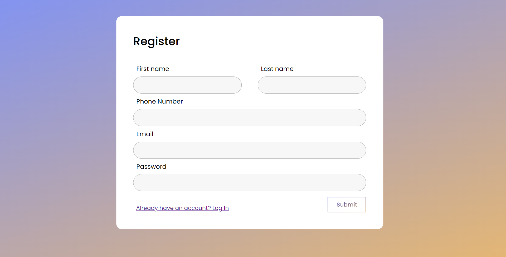
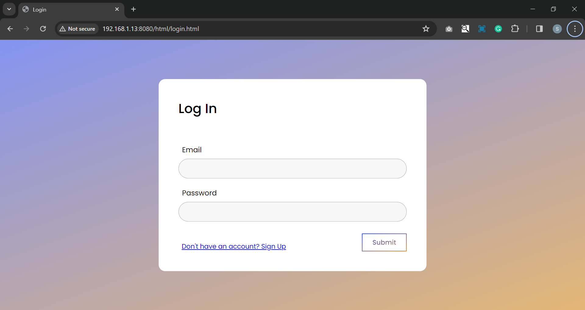
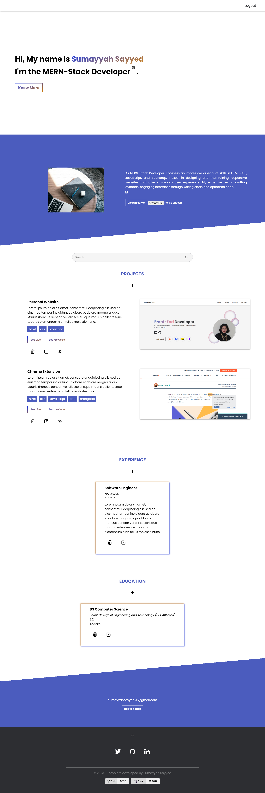

# Customizable Portfolio

## Table of contents

- [Overview](#overview)
  - [Project](#project)
  - [Screenshot](#screenshot)
- [Process](#process)
  - [Built with](#built-with)
- [Author](#author)

## Overview

### Project

Create a versatile portfolio tool for recruitment purposes, allowing users to easily customize their page with information on expertise and objectives. Users can effortlessly add, view, update, and delete projects and other sections. The search function filters content within the project, education, and experience sections.

An admin portal provides a comprehensive view of user information. Admins can add or delete users, access user projects, and utilize the search feature on both users and their projects. Admins also have the capability to designate other users as admins.

### Screenshot

- User Portfolio

<video width="320" height="240" controls>
  <source src="My-Design/editable-content.mp4" type="video/mp4">
</video>

- Admin Portal

## Process

### Built with

- Semantic HTML5 markup
- CSS custom properties
- Flexbox
- Grid
- JavaScript
- Node Js
- Local Storage
- My SQL

## Author

[SumayyahSayyed]
